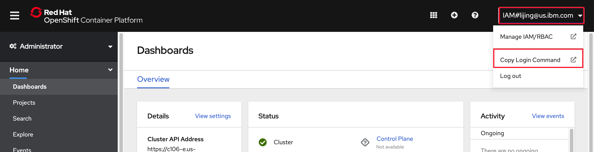
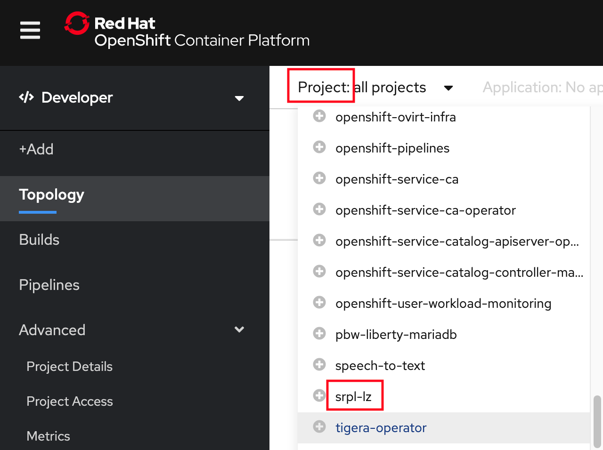
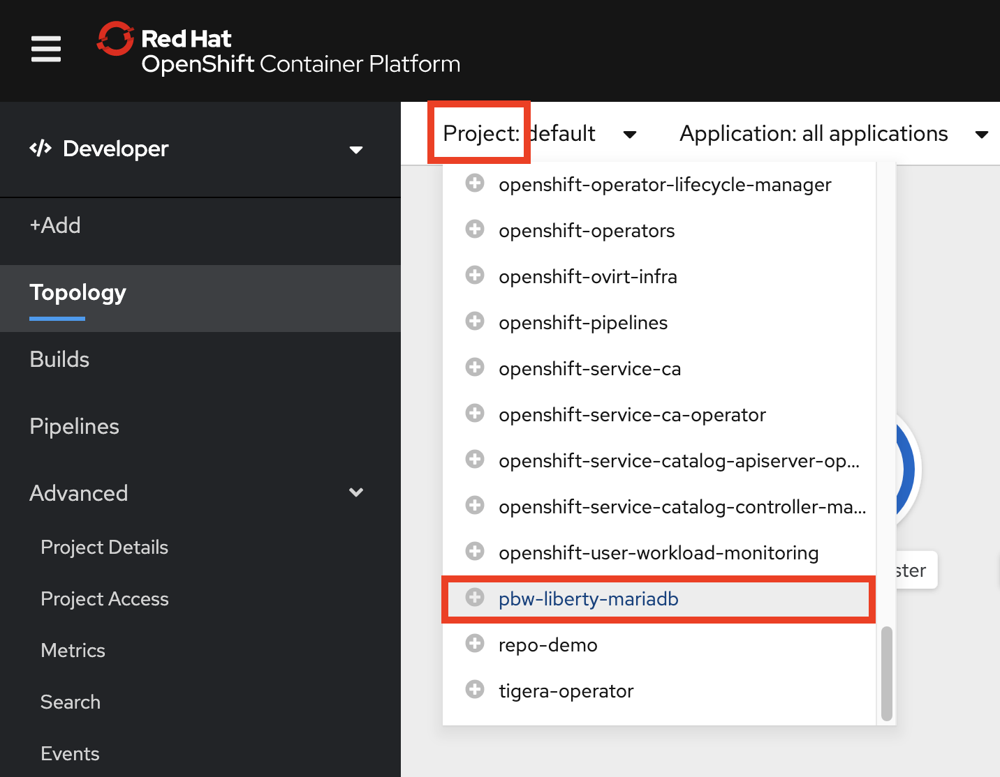
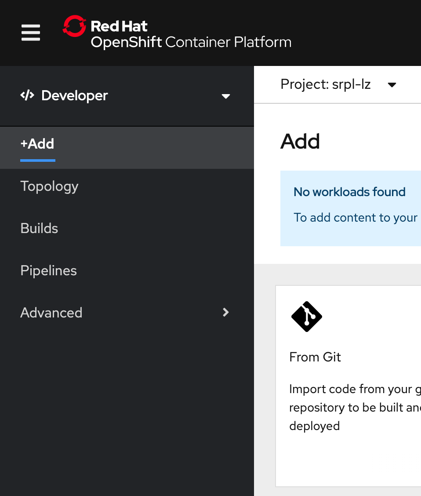
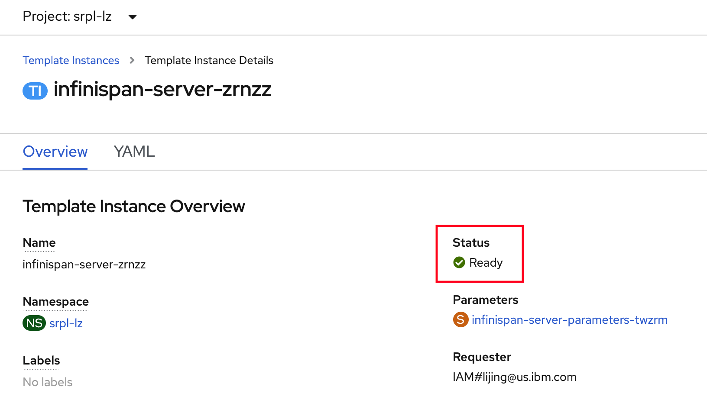
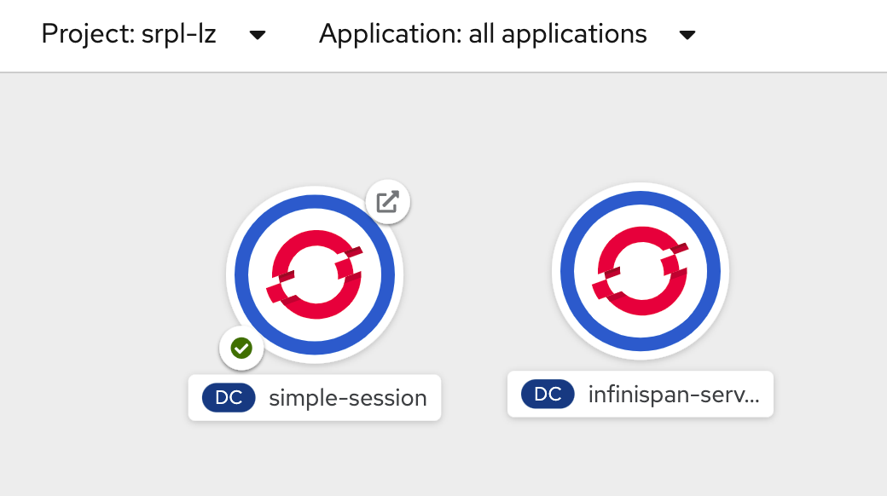
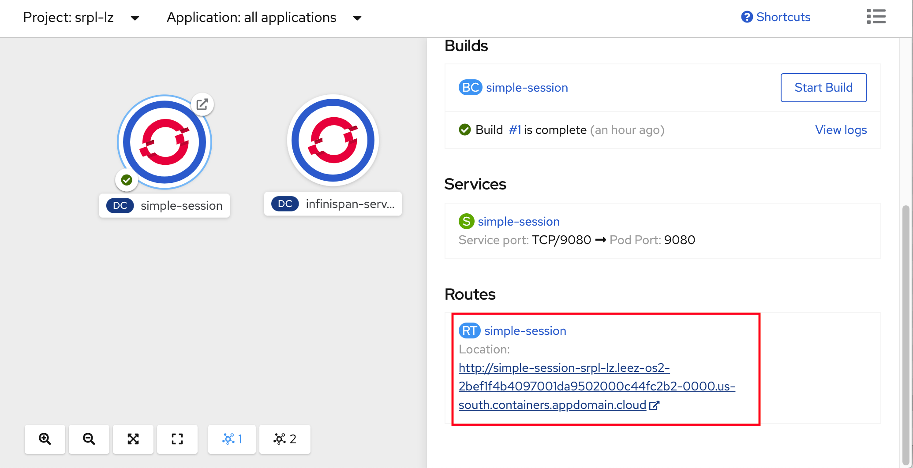
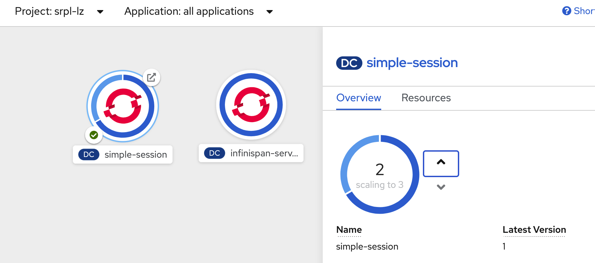
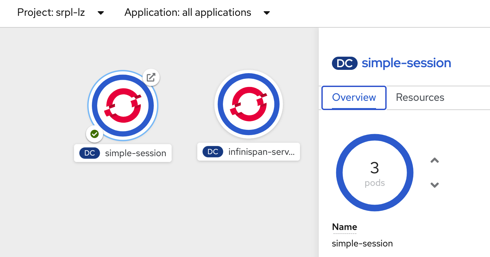

# IBM Client Developer Advocacy App Modernization Series

## Lab - HTTPSession replication in WebSphere Liberty on OpenShift

## Overview

WebSphere Liberty has a feature called **sessionCache-1.0** which provides distributed in-memory HttpSession caching. The **sessionCache-1.0** feature builds on top of an existing technology called JCache (JSR 107), which offers a standardized distributed in-memory caching API. However, even though the feature builds on top of JCache, no direct usage of JCache API is necessary in your application, since Liberty handles the session caching in its HttpSession implementation. In fact, if your application is already using HttpSession caching, it can benefit from **sessionCache-1.0 without making any code changes.**

In this lab you'll use these  capabilities  to deploy and test  a small Java EE app on OpenShift. You'll use an Open Source JCache provider called [Infinispan](https://infinispan.org) to provide the implementation of the JCache support that is included in Liberty. Note that any compliant JSR 107 product can be used in this manner with WebSphere Liberty.

### Step 1: Logon into the OpenShift Web Console and to the OpenShift CLI

1.1 Login into the OpenShift web console using  your user credentials

1.2 From the OpenShift web console click on your username in the upper right and select **Copy Login Command**

   

1.3 Paste the login command in a terminal window and run it (Note: leave the web console browser tab open as you'll need it later on in the lab)

### Step 2: Create ImageStreams for the Open Liberty base image and Infinispan server image

2.1 Set an environment variable for your *studentid* based on your user identifier from the instructor (e.g. **user001**). If you have your own cluster, 

```bash
export STUDENTID=userNNN
```

If you have your own cluster, set the environment variable to your initial.

```bash
export STUDENTID=<your initial>
```
2.2 Create a new OpenShift project for this lab

   ```bash
   oc new-project srpl-$STUDENTID
   ```

2.3 Tag the Docker Hub Open Liberty  image to create a local ImageStream

   ```
   oc tag docker.io/open-liberty:latest open-liberty:latest
   ```

2.4 Tag the Docker Hub Infinispan server image to create a local ImageStream

   ```
   oc tag docker.io/infinispan/server:latest infinispan-server:latest
   ```

### Step 3: Install the sample app and Infinispan server using templates  

3.1  From the client terminal window clone the following Git repo with the app used in this lab

   ```bash
   cd ~
   git clone https://github.com/IBMAppModernization/simple-http-session-app.git
   cd simple-http-session-app
   ```

3.2 Add the sample app  and Infinispan server templates to your project

   ```bash
   oc create -f openshift/templates/infinispan
   ```

3.3 In your OpenShift Web console, switch to Developer view.

   

3.4 From the Project dropdown list, select your project(srpl-$STUDENTID).

   

3.5 In top left navigation pane, click on **+Add**.

   

3.6 Click on **From Catalog** tile in the right pane.

3.7 Select **Others**.

3.8 Select the **Infinispan server** template.

3.9 Click **Instantiate Template**.

3.10 Accept all the defaults and click **Create**.

3.11 Wait until the status of the template instance becomes **Ready**.

   

3.12 In top left navigation pane, click on **+Add**.

3.13 Click on **From Catalog** tile in the right pane.

3.14 Select **Others**.

3.15 Select the **Simple HttpSession sample on Liberty** template.

3.16 Click **Instantiate Template**.

3.17 Accept all the defaults and click **Create**.

3.18 Wait until the status of the template instance becomes **Ready**.


### Step 4: Test the sample app

When you bring up the app in a new browser session the banner on the web page will say  **Hello stranger**. A new HTTPSession object is created and it's state is replicated to all the pods. When the app encounters an existing HTTPSession object the banner message will change to **Welcome back friend**.  

4.1 In top left navigation pane of the web console, click on **Topology**. Two applications should appear.

  

4.2 Select **simple-session** entry or icon.

4.3 Go to **Resources** tab.

4.4 Scroll down to **Routes** section.

4.5 Click the **Location** link under `simple-session` to launch the sample application.

  

4.6 When the app appears in your browser verify that the banner says **Hello stranger**

   

4.7 Keep refreshing the URL and verify that the POD IP address changes each time and the current state of the session data is maintained and used by all pods (i.e. the banner should say **Welcome back friend**  and the access count should keep incrementing). Keep this browser tab open as you'll need it for further testing.

   

4.8 Next you'll verify that if you increase the number of replicas the new replicas will automatically access the shared session state. 

4.9 In your Web console browser tab, go to **Overview** tab.

4.10 Increase the number of pods for the **simple-session** app to 3 as illustrated below:

   

4.11 Wait for the 3rd pod to be ready (ie circle around number of pods will be a  uniform  color)

   

4.12 Go back to the browser tab where you had the **simple-session** app running and keep refreshing the page. Verify that the 3rd pod is now being accessed and that the access count is never reset to 0. Now, you should rotate between 3 **POD Name** and **POD IP address** when refreshing the sample app.

## Cleanup

Run the following commands to cleanup (note: you can copy all the commands at once and post them into your command window)

   ```
   oc delete all,routes,is --selector app=simple-session
   oc delete all --selector app=infinispan-server
   oc delete is infinispan-server
   oc delete is open-liberty
   ```
Alternatively, you may delete your project and the action will delete all resources in the project.

    ```
    oc delete project srpl-$STUDENTID
    ```

## Summary
Congratulations. You used the **session-cache** feature in WebSphere Liberty along with the Open Source **Infinispan Data Grid** to demonstrate HttpSession replication in OpenShift. This allowed you to  deploy  a stateful application in a stateless manner (i.e each application pod can be deleted or replaced at anytime without losing application state).
